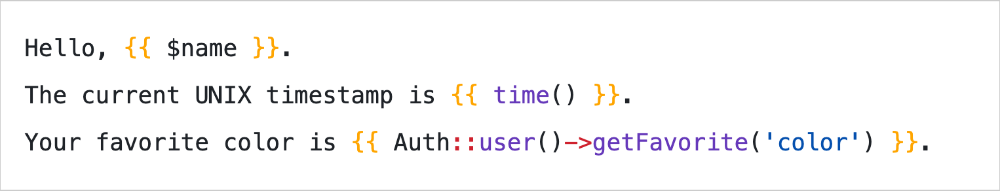
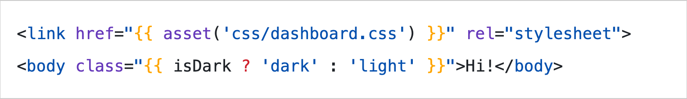
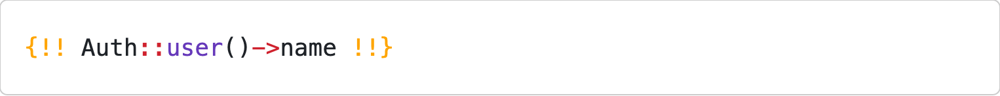
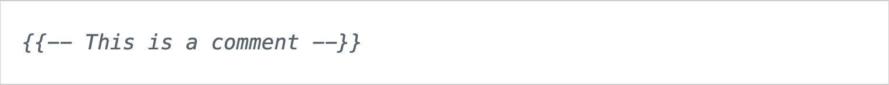
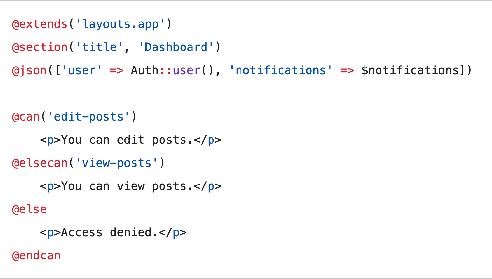
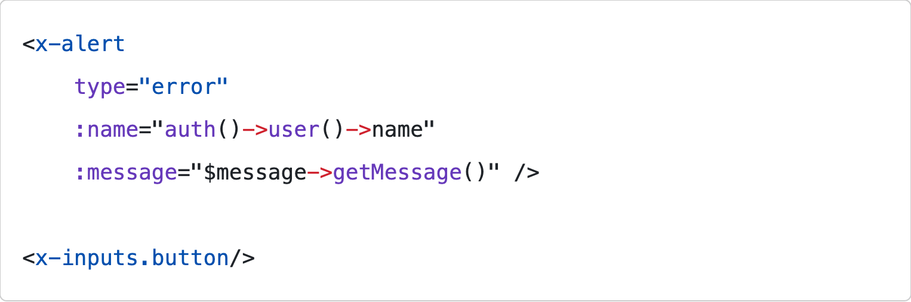
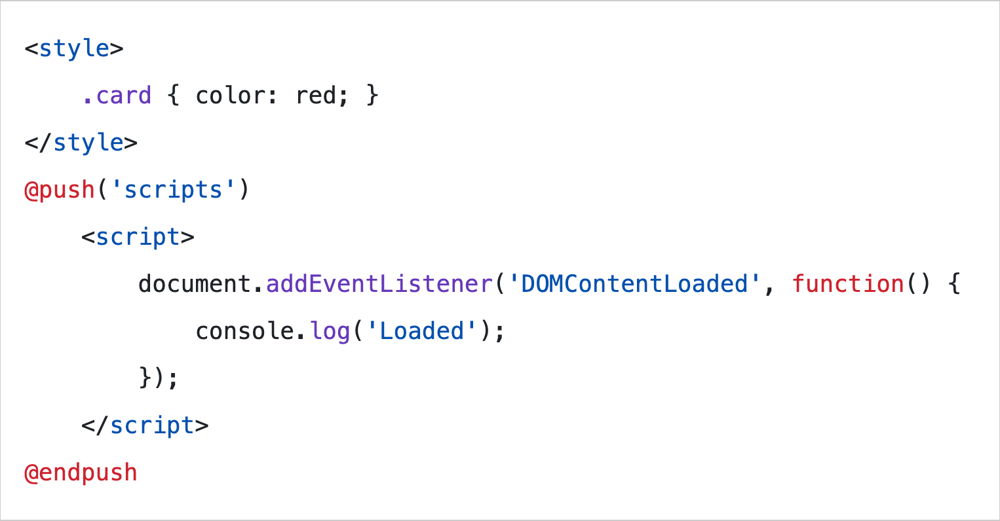
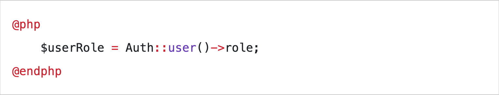
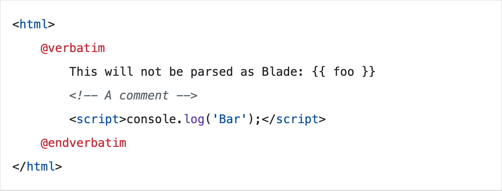

# Prism Blade

Blade Language syntax highlighting for Prism.

- [GitHub](https://github.com/nicodevs/prism-blade)
- [NPM](https://www.npmjs.com/package/prism-blade)

---

### Installation

```sh
npm i prism-blade
```

### Alternative: CDN

```html
<!-- Get Prism from the CDN -->
<script src="https://cdn.jsdelivr.net/npm/prismjs@1.29.0/prism.min.js"></script>

<!-- Make sure to include the following language definitions -->
<script src="https://cdn.jsdelivr.net/npm/prismjs@1.29.0/components/prism-php.min.js"></script>
<script src="https://cdn.jsdelivr.net/npm/prismjs@1.29.0/components/prism-javascript.min.js"></script>
<script src="https://cdn.jsdelivr.net/npm/prismjs@1.29.0/components/prism-css.min.js"></script>
<script src="https://cdn.jsdelivr.net/npm/prismjs@1.29.0/components/prism-markup-templating.min.js"></script>

<!-- Then include the script from the CDN -->
<script src="https://cdn.jsdelivr.net/npm/prism-blade@latest/dist/prism-blade.min.js"></script>
```

---

### Usage

```js
import Prism from 'prismjs';
import 'prism-blade';

const code = `@include('header')`;
const html = Prism.highlight(code, Prism.languages.blade, 'blade');
```

---

### Preview

#### Interpolation



#### Interpolations in attribute values



#### Unscaped interpolation



#### Comments



#### Directives



#### Components



#### Scripts and style blocks



#### @php directive



#### @verbatim directive


